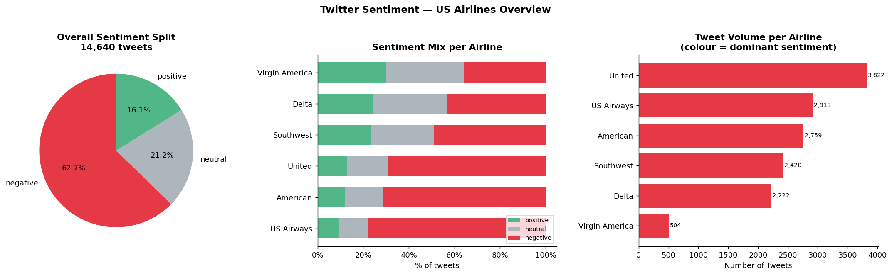
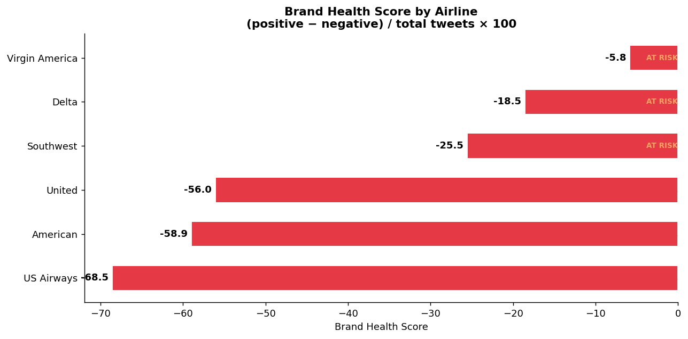
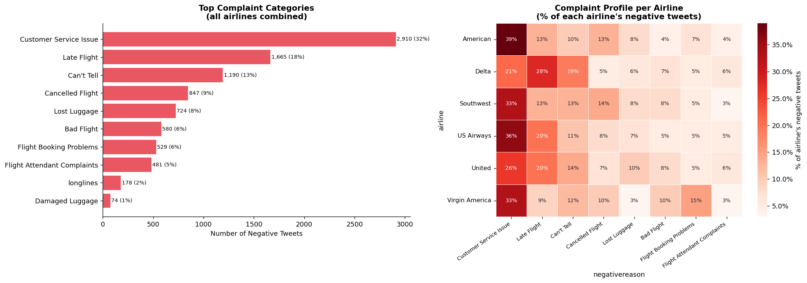
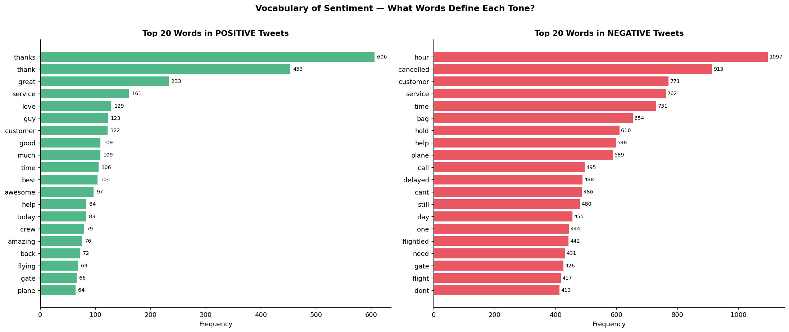
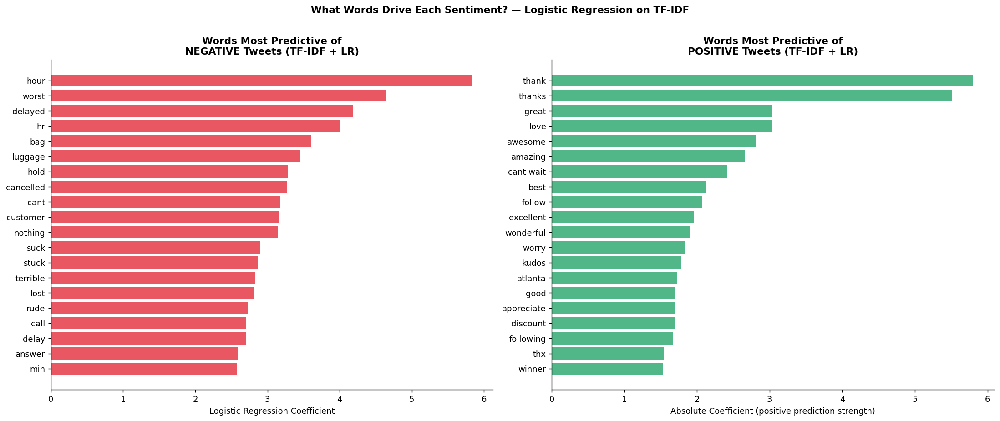

# Brand Sentiment Analysis — Twitter
### What are customers really saying, and can we catch complaints before they go viral?

**Tools:** Python · VADER · TF-IDF · scikit-learn · nltk · seaborn  
**Dataset:** [Twitter US Airline Sentiment](https://www.kaggle.com/datasets/crowdflower/twitter-airline-sentiment) — 14,640 real tweets across 6 US airlines

---

## Business Problem

> *A major US airline wants to benchmark its Twitter reputation against competitors, understand what drives negative sentiment, and build a system to automatically flag incoming complaints for the customer service team.*

---

## Key Findings

| Finding | Business Implication |
|---------|---------------------|
| Platform skews **63% negative** overall | Baseline for comparison — all airlines face this; relative BHS matters more than absolute |
| **Customer Service Issue** drives 32% of all negative tweets | Single biggest lever for reputation improvement |
| **Virgin America** leads with Brand Health Score of −5.8 | Study their service model and tone as a benchmark |
| **US Airways** at BHS −68.5 — critical territory | Immediate reputation intervention needed |
| Negative tweets peak in **early morning hours** | Customer service team should be staffed up overnight |
| TF-IDF classifier achieves **AUC 0.903** | Viable for real-time complaint routing in production |

---

## Brand Health Score Rankings

| Airline | Brand Health Score | Status |
|---------|-------------------|--------|
| Virgin America | −5.8 | ★ Leader |
| Delta | −18.5 | |
| Southwest | −25.5 | |
| United | −56.0 | |
| American | −58.9 | |
| US Airways | −68.5 | ▼ Critical |

**Formula:** `(positive tweets − negative tweets) / total tweets × 100`  
Range: −100 (all negative) to +100 (all positive).

---

## Model Performance

| Metric | Value |
|--------|-------|
| ROC-AUC | **0.903** |
| Accuracy | **82%** |
| Negative recall | 83% |
| Negative precision | 88% |

**Method:** TF-IDF vectorisation (5,000 features, unigrams + bigrams) → Logistic Regression with class balancing.

---

## Analysis Walkthrough

### Notebook 1 — Sentiment EDA

**Part 1 — Overall Landscape**  
Sentiment split across all airlines (donut chart), per-airline stacked bar, and tweet volume.



**Part 2 — Brand Health Score**  
Single composite metric per airline with GOOD / AT RISK / CRITICAL ratings.



**Part 3 — Why Do People Complain?**  
Breakdown of 10 negative reason categories. Heatmap showing each airline's complaint profile — who suffers most from delays vs lost baggage vs poor customer service.



**Part 4 — Sentiment by Time of Day**  
Tweet volume and negative rate by hour — identifies peak complaint windows for customer service staffing decisions.

---

### Notebook 2 — NLP Deep Dive

**Part 1 — Text Cleaning**  
Strips URLs, mentions, hashtags. Tokenises, removes stopwords, lemmatises.

**Part 2 — VADER Sentiment Scoring**  
Applies VADER (built for social media) to produce a continuous −1 to +1 score per tweet. Compares VADER labels vs human annotations — 49% agreement highlights genuine label ambiguity in the neutral zone.

**Part 3 — Word Frequency Analysis**  
Top 20 words in positive vs negative tweets after cleaning. Shows clear vocabulary separation between complaint language and praise language.



**Part 4 — TF-IDF Complaint Classifier**  
Trains a Logistic Regression on TF-IDF features to classify tweets as negative or not. Extracts top predictive words in each direction — the most interpretable output for a business stakeholder.



**Part 5 — Per-Airline Complaint Heatmap**  
VADER score broken down by airline × complaint type — shows which issues cause the most emotional intensity per airline.

**Final Output — Client Memo**  
Written as a structured analyst memo to a Head of Marketing: executive summary, brand rankings, 5 key findings, 5 prioritised recommendations.

---

## How to Run

```bash
# 1. Clone
git clone https://github.com/Jaslinegati/brand-sentiment-analysis

# 2. Create virtual environment
python3.11 -m venv .venv
.venv/Scripts/pip install -r requirements.txt

# 3. Download dataset from Kaggle into data/raw/
# https://www.kaggle.com/datasets/crowdflower/twitter-airline-sentiment
# File needed: Tweets.csv

# 4. Run notebooks in order
jupyter lab
```

---

*Prepared by Jasline Mwita — Data Analyst & Data Scientist*
